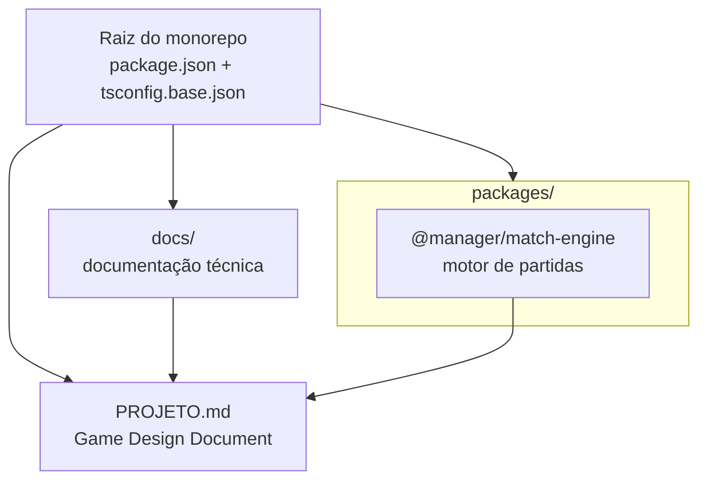
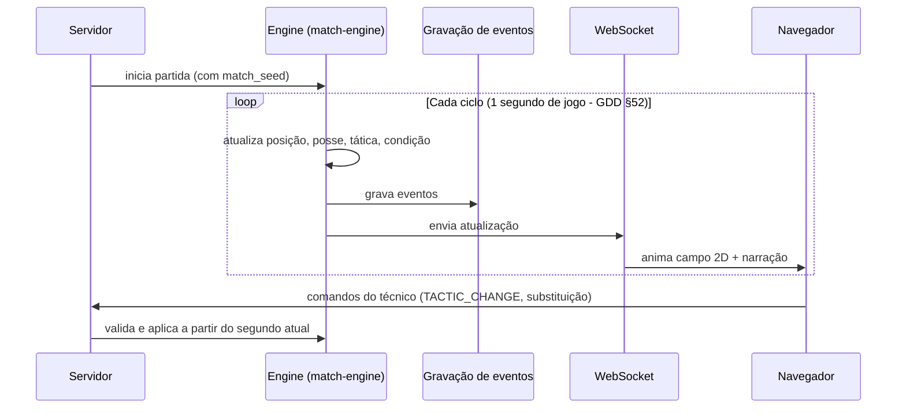

# 01 — Arquitetura

> Visão técnica do sistema. A visão do *jogo* está no
> [GDD (`PROJETO.md`)](../PROJETO.md).

## 1. Princípios técnicos (derivados do GDD)

| Princípio | Origem no GDD | Implicação técnica |
|-----------|---------------|--------------------|
| Motor independente da interface | §103 | `match-engine` é um pacote isolado: recebe dados, devolve estado/eventos. Sem dependência de UI ou rede. |
| Simulação determinística por seed | §104 | Toda aleatoriedade vem de um RNG com seed explícita. `Math.random()` é proibido no motor. |
| Servidor autoritativo | §105 | Todas as decisões (resultado, dinheiro, draft) acontecem no servidor; o navegador só envia comandos. |
| Prioridade: validar o motor | §113 | A ordem de desenvolvimento começa pelo motor de partidas (ver [Roadmap](03-ROADMAP.md)). |
| MVP primeiro | §109–114 | Escopo mínimo validado antes de recursos administrativos. |

## 2. Estrutura atual do monorepo

O projeto usa **npm workspaces** (decisão [ADR-001](02-DECISOES-TECNICAS.md)):
cada parte independente do sistema vive em `packages/` com seu próprio
ciclo de teste e tipagem.



### Árvore de diretórios

```
.
├── PROJETO.md                     # GDD (fonte da verdade do jogo)
├── README.md                      # Visão geral técnica
├── package.json                   # Raiz: workspaces + scripts globais
├── tsconfig.base.json             # TypeScript strict compartilhado
├── .gitignore
├── docs/                          # Toda a documentação técnica
└── packages/
    └── match-engine/              # Motor de partidas
        ├── README.md              # Status e convenções do pacote
        ├── package.json
        ├── tsconfig.json
        ├── src/
        │   ├── index.ts           # API pública (exportações)
        │   ├── rng.ts             # RNG determinístico (etapa 1)
        │   ├── match-state.ts     # Tipos/constantes do estado (etapa 2)
        │   ├── engine.ts          # Ciclo de simulação (etapa 2)
        │   ├── player.ts          # Atributos do jogador (etapa 3)
        │   ├── actions.ts         # Passe, drible, finalização (etapa 3)
        │   ├── events.ts          # Eventos da partida (etapa 5, §91)
        │   ├── xg.ts              # xG (etapa 5, §60)
        │   └── stats.ts           # Estatísticas (etapa 5, §59)
        └── tests/
            ├── rng.test.ts                # Testes com valores golden
            ├── engine.test.ts             # Ciclo, condição e determinismo
            ├── actions.test.ts            # Chance, sensibilidade e validações
            ├── controlled-randomness.test.ts  # Propriedades estatísticas (§56)
            └── stats.test.ts              # Eventos, xG e estatísticas (§59–60)
```

## 3. Arquitetura alvo do motor (prevista no GDD §106)

O fluxo abaixo é o previsto no GDD para partidas em tempo real.
**Apenas a "Engine" está iniciada** — os demais elementos são futuros.



## 4. Stack atual

| Camada | Tecnologia | Status | ADR |
|--------|------------|--------|-----|
| Linguagem | TypeScript (strict) | ✅ Em uso | ADR-002 |
| Monorepo | npm workspaces | ✅ Em uso | ADR-001 |
| Testes | Vitest 0.34.6 | ✅ Em uso | ADR-004 |
| Front-end | — | ⬜ Não definido (GDD §102 sugere React/Next.js) | — |
| Banco | — | ⬜ Não definido (GDD §102 sugere PostgreSQL) | ADR-003 |
| Cache/Tempo real | — | ⬜ Não definido (Redis/WebSocket são futuros) | ADR-003 |

## 5. Regras de dependência entre camadas

1. `match-engine` **não** pode importar de apps, banco ou rede — apenas
   código puro do próprio pacote.
2. A interface (futura) depende do motor, nunca o contrativo.
3. Nenhuma dependência nova entra sem registro em
   [ADR](02-DECISOES-TECNICAS.md) e na
   [agenda de alterações](REGISTRO-DE-ALTERACOES.md).
